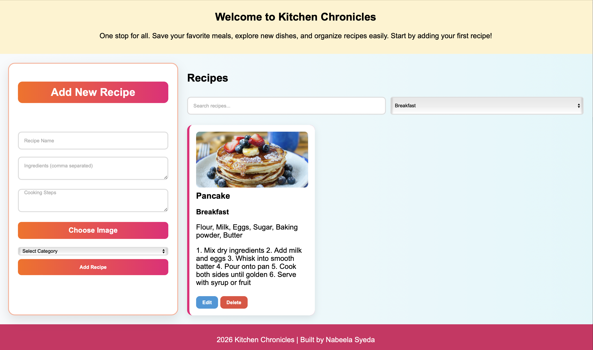

# nsyeda12.github.io

**Kitchen Chronicles**

**About This Project**
Kitchen Chronicles is a simple recipe sharing platform. It is basically a website to post and browse recipes where you can add, view, edit, and delete recipes. I made this project to practice HTML, CSS, and JavaScript.

The goal was to create something useful and easy to use, where users can keep all their recipes in one place.

**Layout**

**Features**
- Add new recipes with name of the dish which is title, ingredients, and steps to cook the dish  
- Upload and preview recipe images  
- You can also edit already existing recipes  
- Delete recipes  
- You can search recipes by their name or ingredients  
- Filter recipes by category (Breakfast, Lunch, Dinner, Dessert)  

**How It Works**
- The left side has a form where you can add or edit recipes  
- The right side shows all the recipes    
- You can search or filter recipes anytime  

**Technologies Used**
- HTML  
- CSS  
- JavaScript 

**Screenshot**

**Future Improvements**
- Add backend/database  
- A system where users can login    
- More categories and features  

**Built by**
Nabeela Syeda  
